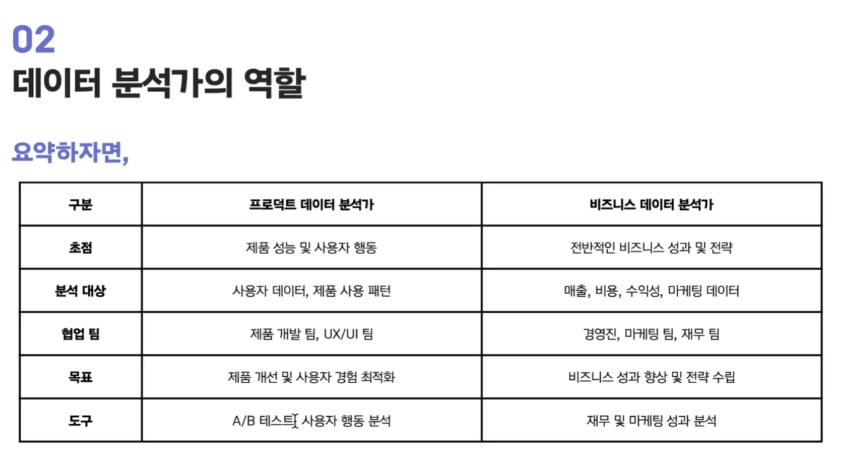

# 20250212 현직자 특강

- 현직자와의 커피챗 적극 추천
- 데이터 분석이 현업에서 어떻게 사용되는지? / 서류, SQL 테스트, 면접 등 어떤 부분을 어필해야할지?

## 목표

- 실무 사례를 통해 이론과 실무의 간극을 좁히고, 데이터 분석가의 역할 이해하기

### 프로덕트와 비즈니스의 관계

- 포함관계: 프로덕트, 마케팅, 재무... < 비즈니스
- 다양한 요소들이 상호보완적으로 비즈니스의 성장을 이룩하는데 기여하고 있따

### 데이터 분석가의 역할

- Business Data Analyst / Product Data Analyst: 프로덕트/비즈니스에 관해 바라보는 관점만 다를 뿐, 본질적으로 데이터를 분석한다는 것은 동일

- but, 둘은 크게 다르지 않다

- 본질: '데이터를 분석하고 인사이트를 도출한다'
- 차이: '어떤 문제를 풀고 싶은가?'에서 발생
- 예시
  - 상품의 구매 전환율이 계속 하락해요 -> 사용자 행동 기반 분석
  - 물류 비용상승으로 순수익이 감소하고 있어요 -> 비즈니스 분석
  - MZ 세대 타겟 광로를 어떤 채널에 집행하는게 좋을지 모르겠어요 -> 마케팅 분석
- 현실: 다 할 줄 알아야한다 -> 난 어떤 분석가 할꺼야!보다는 데이터를 어떻게 잘 분석할 수 있을까?에 집중하기

### 데이터 분석 실무 사례 소개

- 서비스를 쓰면서 내가 분석가라면 어떤걸 해볼 것인가 -> 평소에 고민을 많이 해놔야 (회사에 대한 애정도 or 순간적인 논리 센스 볼 수 있음)

1. 지그제그 사례 1. 프로덕트 내 다양한 커뮤니케이션 지면 기획, 테스트, 분석, 고도화, 운영
   - 지면 카테고리 배치: 클릭 로그 확인, 거래액 지표 확인, A/B 테스트
2. TURU CAR 사례 2. 데이터를 통한 푸시 메시지 기획
   - 선행 분석 진행, A/B 메세지

### 데이터 분석가 채용 프로세스 팁

#### 일반적인 프로세스
- 서류 -> 쿼리 테스트/과제 -> 직무 인터뷰 -> 문화 인터뷰

#### 서류

- 지원공고 10번 정독하고 작성 시작
  - 화면 한켠에 지원공고가 보이게끔 위치시키고 계속계속 보기
  - 회사에서 뽑고자 하는 사람에 대한 정보가 다 적혀있음
- 경험 선택하기
  - 어필하려는 마음에 저 이것도 했구요 저것도 했구요 -> X
  - 직무와 관련된 부분을 우선적으로 작성
  - 지원공고를 보고도 경험을 가지치기 해보기
- 면접에서 어떻게 말할지 생각하고 글로 잘 풀어쓰기
  - 궁국적인 목표는 결국 면접 최종 합격
  - 작성 내용을 면접에서 어떻게 풀어서 설명할지 고민 후 서류 작성하기

#### 쿼리 테스트 / 과제

1. 쿼리테스트
- 냅다 쿼리짜기 보다는 어떻게 짤지 설계하고 깔끔하게 작성하는 것 추천
- 기대하는 출력 결과물은 있지만, 어떤 의도를 가지고 로직을 설계하는지를 평가

2. 과제
- 가독성이 매우 중요 (엄청나게 참신한 내용이라도 가독성 안좋으면 안 읽힘)
- 본인이 한 프로젝트를 잘 설명만해도 반은 먹고 감
- STAR 기법 추천 (Situation, Task, Action, Result)
- What보다는 Why, How에 집중하기 (~ 했다보다 왜 했고, 어떻게 했는지에 집중)

#### 인터뷰

1. 구조화 질문
- 꼬리질문 많이 나오는 편
- 이때 사람들이 궁금한건 Why, How와 관련된 부분

2. 문화 인터뷰
- 정답은 없음
- 동일한 질문에 동일하게 대답해도 어떤 회사에선 붙고 어떤 회사에선 떨어짐
- 본인의 잘못이 아닌 운과 회사와의 Fit이 중요

#### 메타인지
- 모든걸 관통하는 '메타인지'가 가장 중요
- 본인이 뭘 좋아하고 잘하는지, 약점은 무엇인지 스스로 객관적으로 바라보기
- 메타인지가 되어있으면 지원해봄직한 회사와 아닌 회사가 나뉨 (이러한 인재상/핵심 가치에서 내가 일을 잘 할 수 있겠다)
- 나에 대한 인지 + 현 상황을 알면, 내가 이 회사가 필요한 이유가 자연스레 떠오름 -> 이게 가장 먹히는 지원동기

### Q&A

- what보단 why와 how
- 경력직도 넣어라!
- 도메인 어필은 본인의 솔직한 감정과 경험을 기반으로(말하면 묻어난다)
- 스타트업 포트폴리오: 이력서 70%(가독성, 일목요연), 포트폴리오 30%(why, how에 집중해서 이력서의 내용을 상세하게 보여주기)
- 회사 산업 도메인에 대한 관심 + 기본적인 분석적/논리적 사고력을 많이 본다
- 통계를 다 알 필요는 없지만 중요한건 툭 치면 나올 정도로 나와야
- 번개장터의 데이터 인프라 굿, 당근은 거의 없는 상황이었다, 토스는 데이터가 너무 많아서 뭘볼지가 어려움 <- 이렇듯 상황이 다 다름
- A/B 테스트 결과가 원하는 방향으로 나오지 않는다면 받아들여야...
- 하드스킬은 SQL이 중요 (파이썬 < SQL)
- 현실에서는 

